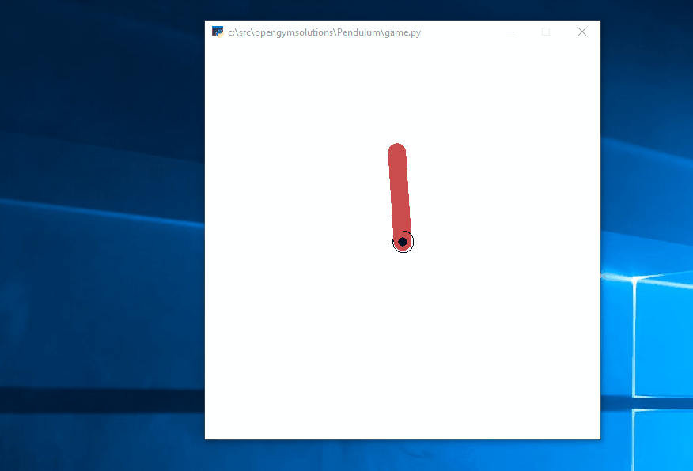

# The problem
It is my solution (games.py) to the OpenAI Gym problem Pendulum-v0 ( https://gym.openai.com/envs/Pendulum-v0/). Characteristics of the environment can be described in the following wiki: https://github.com/openai/gym/wiki/Pendulum-v0.

# Algorithm explanation
The implementation is mostly based on my previous code for cartpole with the following changes:
1) Since it is an endless environment, break it up into a few steps will help the training and evaluation of the progress.
2) The default value of the any state should set to lowest in this case -16.2736044 instead of 0.
3) The actions now have more options instead of 0 or 1, I chose -2.0 to 2.0 with 0.5 steps.
4) Since the actions space are relative big, I increase the N) to 1000 to maximize the exploration.
5) To speed up the training, you can disable the render of the graphic.

# Results
After about 6 hours of training, I got the following result. Perfect score.
