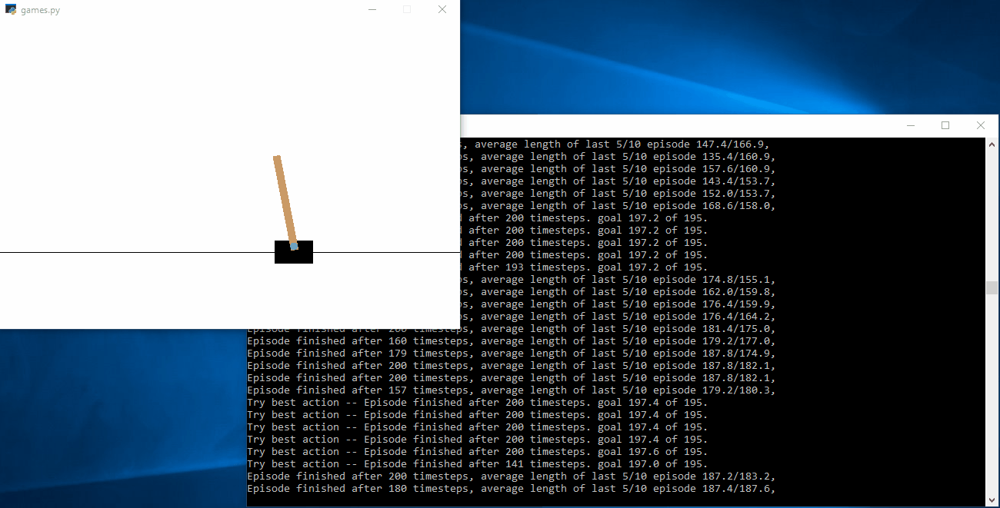

# The problem
It is my solution to the OpenAI Gym problem CartPole-v1 ( https://gym.openai.com/envs/CartPole-v1/). Characteristics of the environment can be described in the following wiki: https://github.com/openai/gym/wiki/CartPole-v0.

# Algorithm explanation
Observation of the environment will be converted to internal representation as states which are represented as string for easy store and compare [see](https://github.com/DerekLiang/opengymsolutions/blob/2ddc49fbacbea3edc9fc89999743db2909897bdc/cartpole/games.py#L16).

Actions are not abstracted and can be represented as integer 0 or 1.

Hash map is used to store states in the game as well as state-action-state counter in the state class for fast lookup.

Backup method is used to update values of the states. Update order is based on the difference. The bigger difference is the earlier the update occurs. Update rate is set to 0.1 from original 0.01. With the above optimization, I see significant speed-up in training.

Every 10 explorations there will be 1 exploitation which shows the progress of the training. In the exploitation stage, no value will be updated and the main purpose is to see how good the current model is. In the exploration stage, you might not get the good results (i.e. longer episodes) because it will try the actions that haven't tried before. Also for the exploitation stage, the results will not always be improving, since the environment observations having uniform random value between ±0.05.

# Results
After about 1 hour of training, I got the following result. And after about 12 hours, I got almost perfect score 199.7 out of 200.
